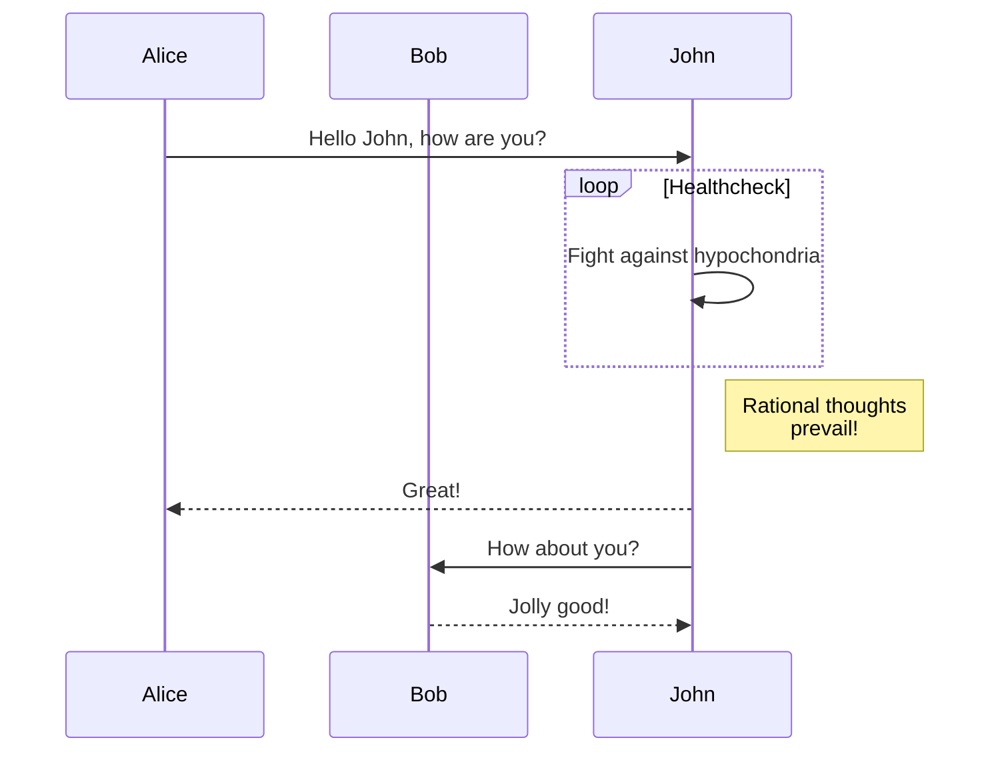

Notes on variations from "System.CommandLine Extensibility"

* Order dependencies - generally the first thing that succeeds blocks all other subsystems
  * Many subsystems will have the dependency that they run after validation. This includes all error reporting and invocation - consider a phased approach for this.
  * It would be inefficient for items that do not need validated data to run after validation as it may be expensive
  * The order dependency within a phase is primarily to determine which should run when two things are selected. This is needed for diagramming and illustrates the old pattern of directives, then option commands (help), then commands.
  * The simplest way to do this may be to maintain the concept of directives as a phase, not a syntax, and let the subsystem determine if it should run. This will be valuable for back compat.
  * Does anything need to run after invocation? We previously had an exception handler that Jon thought people appreciated. I may write one.

* Data dependencies
  * A subsystems will rely on other systems. For example, something running before help may want a description
  * The description is at least as likely to be needed by something that runs after help when help didn't run
  * The best approach for data dependencies is that subsystems should not require being executed to supply data
  * Subsystems may require validation to supply data
  * A complex example

* Can we delete the projects that are not part of this effort? Could we add them back if we are wrong and preserve any history?

* The pipeline sample hard codes a series of execution steps. I do not see how this is extensible to two currently unknown subsystems. I think we need a collection here.

* Defaults
    * It is desirable to have the default values be calculated once when first requested (mostly for wide CLIs) and not calculated if not requested
    * This appears to require that we have a common type for the default system (you can't replace it) is that the intent? (a common type, a base class or an interface)
    * The same is true of validation, or how could the help system use them

* Validation: The examples in the doc appear to combine validation and error reporting into one step. I do not think this is desirable as error reporting was a point of customization. 
    
* I think it could be quite good to treat defaults and validation as having a set interface. 

* Small thing: The annotation ids do not appear to have a separator, which could lead to ambiguity (`nameof(A) + "BC"` vs `nameof(AB) + "C"`)

* We have history that the order of extension execution (and possibly initialization and teardown) is difficult and essential. We need to control this in almost all cases
   * Where the user needs something else to control ordering, allow inheritance of the Runner
   * This is addressed here with Category to get things rolling and to isolate the issue, but needs more attention

* Extension and PipelineExtension are separated so users in normal settings can ignore the pipeline details
  * An alternative would be to simplify it enough to recombine, but details like whether something is activated (such as the user entering "-h" being a trigger being isolated to the help subsystem) may be surprising

  * -- May delay below

* I think we need one high level concept that knows configuration, CLI declaration. I find this most natural to call a parser
  (thus the user in building up their CLI builds a custom parser in concept), a CLI configuration that contains a declaration
  the second most natural and a RootCommand with a Config hanging off it the least natural. I used configuration as the most 
  clear in our current state

* Should issues on initialization, including licensing and other extension specific expected error, be handled via exceptions

* Pipeline is unique from Invocations, because a CLI author might want everything handled, except command invocation
  * This might be true for a single level command without subcommands, for example, which would avoid the complexity of a delegate

* I added the concept of a PipelineResult to avoid polluting ParseResult with data unneeded by the parser
  * This includes ParseResult, and two things only of interest to the Pipeline/Invocation: Handled and ExitCode
  * Passing a PipelineResult that included Handled allows extensions to execute, even if something already handled the result (as opposed to returning a bool)
  * We could use a tuple, but that would be fragile if more needs to be added in the future

